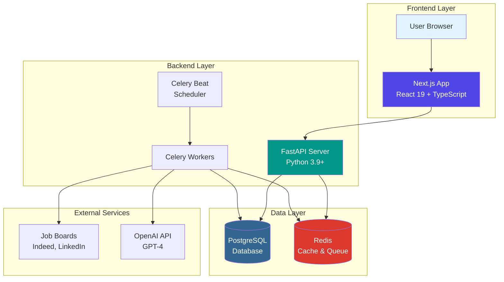

<div align="center">

<!-- Logo Placeholder -->


# JobFlow

### AI-Powered Job Application Automation Platform

<!-- Badge Links - Placeholders -->
[](https://jobflow.example.com)
[](https://docs.jobflow.example.com)
[](LICENSE)

<!-- Technology Badges -->
[](https://nextjs.org/)
[](https://reactjs.org/)
[](https://fastapi.tiangolo.com/)
[](https://www.python.org/)
[](https://www.postgresql.org/)
[](https://www.typescriptlang.org/)

</div>

---

<!-- Screenshot Placeholder -->
<div align="center">
  
  <p><em>JobFlow Dashboard - Streamline your job search with AI-powered automation</em></p>
</div>

---

## 📚 Documentation

**[View Full Documentation](https://docs.jobflow.example.com)** *(Coming Soon)*

For detailed guides, API references, and comprehensive examples, visit our documentation site. Learn how to maximize your job search efficiency with JobFlow's powerful automation features.

---

##  Why JobFlow?

### The Problem

Job seekers face significant challenges in today's competitive market:

**Without JobFlow:**
- ❌ **8-10 hours/week** wasted on manual job board searches
- ❌ **Scattered applications** across multiple platforms with no tracking
- ❌ **Generic cover letters** that fail to stand out
- ❌ **Missed opportunities** due to delayed responses
- ❌ **Low application quality** from repetitive, rushed submissions
- ❌ **Poor success rates** averaging only 2-3% response rate

**With JobFlow:**
- ✅ **70% time savings** - Reduce job search to 2-3 hours/week
- ✅ **Unified dashboard** - Track all applications in one place
- ✅ **AI-personalized letters** - Stand out with tailored cover letters
- ✅ **Automated monitoring** - Never miss a new opportunity
- ✅ **Higher quality** - Focus on customization, not repetition
- ✅ **2x better results** - Improved response and interview rates

---

##  What JobFlow Does

JobFlow automates your entire job search pipeline while maintaining personalization and quality.

### Core Features

####  **Multi-Source Job Ingestion**
Automatically scrape and aggregate job listings from multiple platforms:
- Indeed, StepStone, LinkedIn integration
- 6-12 hour refresh cycles for latest opportunities
- Smart deduplication (URL + title + company)
- 95%+ data quality with validation pipeline

```python
# Example: Automated job discovery
jobs_found = await jobflow.scrape_jobs(
    sources=["indeed", "stepstone", "linkedin"],
    filters={"location": "Berlin", "remote": True}
)
# Returns: 150+ relevant jobs in seconds
```

####  **Smart Filtering & Ranking**
AI-powered job matching based on your profile:
- Resume-based relevance scoring using GPT-4
- Customizable filter pipelines (location, salary, type)
- Save and reuse search configurations
- <2s ranking for 100+ jobs

```python
# Example: AI-powered job ranking
ranked_jobs = await jobflow.rank_jobs(
    jobs=jobs_found,
    resume=user_resume,
    preferences={"min_salary": 60000, "remote_only": True}
)
# Returns: Top 20 matches with 85%+ relevance scores
```

####  **AI-Powered Motivation Letters**
Generate personalized cover letters in seconds:
- OpenAI GPT-4 integration for natural language
- Resume and job description analysis
- Multiple versions with customization options
- Export to text, PDF, or Google Docs

```python
# Example: Generate personalized cover letter
letter = await jobflow.generate_letter(
    job=top_job,
    resume=user_resume,
    tone="professional",
    length="medium"
)
# Returns: Tailored 300-word cover letter in 3 seconds
```

####  **Unified Application Tracking**
Manage your entire application lifecycle:
- Status workflow: New → To Apply → Applied → Interview → Offer/Rejected
- Multiple views: Table, Kanban, Timeline
- Notes and follow-up reminders
- Analytics and success metrics
- CSV/PDF export for records

```python
# Example: Track application progress
await jobflow.update_application(
    job_id=123,
    status="interview_scheduled",
    notes="Technical interview on Friday",
    follow_up_date="2025-12-20"
)
```

####  **Secure Authentication & User Management**
Enterprise-grade security for your data:
- JWT-based authentication with 30-day tokens
- Bcrypt password hashing (12 rounds)
- OAuth integration (Google, LinkedIn)
- GDPR-compliant data management
- Profile customization and preferences

---

## 🛠️ How It Works

JobFlow uses a modern, scalable architecture designed for performance and reliability:



### Architecture Overview

| Component | Technology | Purpose |
|-----------|-----------|---------|
| **Frontend** | Next.js 15 + React 19 | Server-side rendering, responsive UI, real-time updates |
| **Backend API** | FastAPI + Python 3.9+ | Async REST API, JWT auth, OpenAPI documentation |
| **Database** | PostgreSQL 16+ | ACID compliance, JSONB support, optimized indexes |
| **Cache & Queue** | Redis 7 | Session storage, job queue, rate limiting |
| **Task Queue** | Celery + Beat | Async job scraping, scheduled tasks, background processing |
| **AI Engine** | OpenAI GPT-4 | Job ranking, cover letter generation, resume analysis |

### Data Flow

1. **User Interaction** → Frontend sends requests to Backend API
2. **Job Discovery** → Celery workers scrape job boards on schedule
3. **AI Processing** → GPT-4 ranks jobs and generates cover letters
4. **Data Storage** → PostgreSQL stores all application data
5. **Real-time Updates** → Redis enables live dashboard updates

---

## 🚀 Quick Start

### Option 1: Docker (Recommended)

The fastest way to get started:

```bash
# Clone the repository
git clone https://github.com/aminlahbib/JobFlow.git
cd JobFlow

# Start all services with Docker
docker-compose up -d

# Run database migrations
docker-compose exec backend alembic upgrade head

# Create your first user
# Visit http://localhost:3000
```

**That's it!** All services are now running:
- 🌐 Frontend: http://localhost:3000
- ⚡ Backend API: http://localhost:8000
- 📚 API Docs: http://localhost:8000/docs

See [DOCKER.md](DOCKER.md) for detailed Docker documentation.

---

### Option 2: Local Development

#### Prerequisites

- **Python 3.9+** (for backend)
- **Node.js 18+** (for frontend)
- **PostgreSQL 16+** (database)
- **Redis** (caching and job queue)
- **OpenAI API Key** (for AI features)

#### Installation

**1. Clone the Repository**

```bash
git clone https://github.com/aminlahbib/JobFlow.git
cd JobFlow
```

**2. Backend Setup**

```bash
cd backend

# Create virtual environment
python3 -m venv venv
source venv/bin/activate  # On Windows: venv\Scripts\activate

# Install dependencies
pip install -r requirements.txt

# Configure environment
cp .env.example .env
# Edit .env with your settings (database, OpenAI API key, etc.)

# Run database migrations
alembic upgrade head

# Start the backend server
uvicorn app.main:app --reload
```

Backend will be available at `http://localhost:8000`

**3. Frontend Setup**

```bash
cd ../frontend

# Install dependencies
npm install

# Configure environment
cp .env.example .env.local
# Edit .env.local with your settings

# Start the development server
npm run dev
```

Frontend will be available at `http://localhost:3000`

**4. Start Background Workers (Optional)**

```bash
cd backend

# Start Celery worker
celery -A app.core.celery_app worker --loglevel=info

# Start Celery beat (for scheduled tasks)
celery -A app.core.celery_app beat --loglevel=info
```

### First Steps

1. 📝 **Register an account** at `http://localhost:3000/auth/signup`
2. 📄 **Upload your resume** in your profile settings
3. 🔍 **Create a search pipeline** with your job preferences
4. 🤖 **Let JobFlow find jobs** - automated scraping runs every 6-12 hours
5. ✉️ **Review and apply** - use AI-generated cover letters for top matches

### API Documentation

Interactive API docs available at:
- **Swagger UI**: `http://localhost:8000/docs`
- **ReDoc**: `http://localhost:8000/redoc`

---

## 📁 Project Structure

```
JobFlow/
├── backend/                    # FastAPI backend
│   ├── app/
│   │   ├── api/               # API endpoints
│   │   │   └── v1/
│   │   │       ├── endpoints/ # Route handlers
│   │   │       └── api.py     # API router
│   │   ├── core/              # Core utilities
│   │   │   ├── security.py    # JWT & password hashing
│   │   │   └── celery_app.py  # Celery configuration
│   │   ├── models/            # SQLAlchemy models
│   │   ├── schemas/           # Pydantic schemas
│   │   ├── tasks/             # Celery tasks
│   │   ├── config.py          # Settings
│   │   └── main.py            # FastAPI app
│   ├── tests/                 # Backend tests
│   ├── alembic/               # Database migrations
│   ├── Dockerfile             # Backend container
│   └── requirements.txt       # Python dependencies
├── frontend/                  # Next.js frontend (submodule)
│   ├── src/
│   │   ├── app/              # App router pages
│   │   ├── components/       # React components
│   │   └── lib/              # Utilities
│   ├── Dockerfile            # Frontend container
│   └── package.json          # Node dependencies
├── docs/                     # Documentation
├── openspec/                 # OpenSpec workflow system
├── docker-compose.yml        # Full stack orchestration
├── DOCKER.md                 # Docker documentation
└── README.md                 # This file
```

---

## 🎯 Features Roadmap

| Feature | Status | Description |
|---------|--------|-------------|
| 🔐 Authentication | ✅ Complete | JWT auth, OAuth, GDPR compliance |
| 🔍 Job Scraping | 🚧 In Progress | Multi-source job ingestion |
| 🎯 AI Ranking | 📋 Planned | GPT-4 powered job matching |
| ✍️ Cover Letters | 📋 Planned | AI-generated personalized letters |
| 📊 Application Tracking | 📋 Planned | Kanban board, analytics |
| 📧 Email Integration | 📋 Planned | Auto-send applications |
| 📱 Mobile App | 💡 Future | iOS & Android apps |

---

## 🤝


##  Contributing

We welcome contributions! Please see our [Contributing Guide](CONTRIBUTING.md) for details.

---

##  License

This project is licensed under the MIT License - see the [LICENSE](LICENSE) file for details.

---

##  Acknowledgments

- Built with [FastAPI](https://fastapi.tiangolo.com/)
- Powered by [OpenAI GPT-4](https://openai.com/)
- UI components from [shadcn/ui](https://ui.shadcn.com/)
- Inspired by the need to make job searching less painful

---

<div align="center">
  <p>Made with ❤️ by the JobFlow Team</p>
  <p>
    <a href="https://github.com/aminlahbib/JobFlow">⭐ Star us on GitHub</a> •
    <a href="https://github.com/aminlahbib/JobFlow/issues">🐛 Report Bug</a> •
    <a href="https://github.com/aminlahbib/JobFlow/issues">💡 Request Feature</a>
  </p>
</div>
