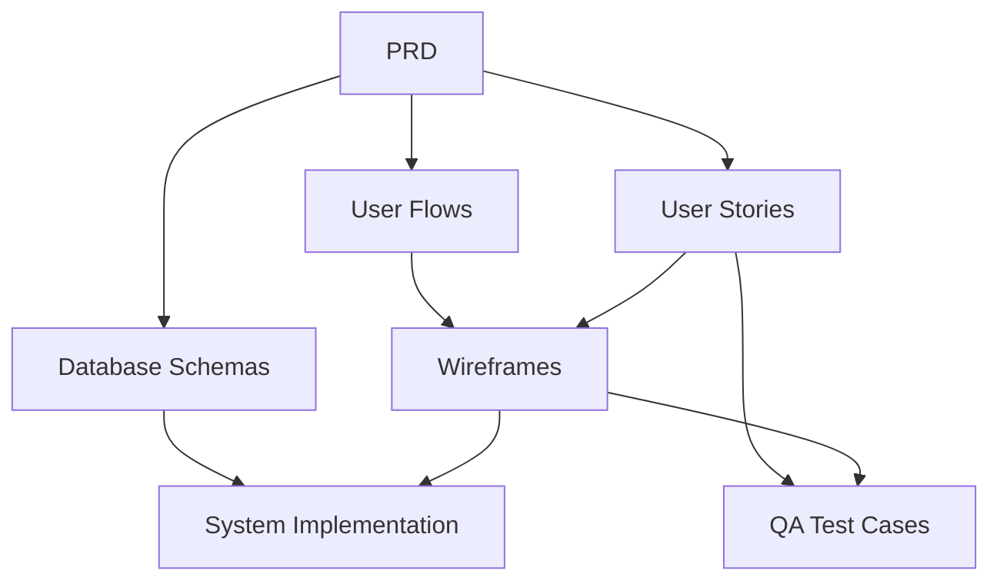

# JobFlow Documentation
## Job Application Automation Platform

**Last Updated:** December 2025

---

## Documentation Index

This directory contains comprehensive documentation for the JobFlow platform, covering product requirements, user flows, system design, wireframes, and user stories.

### 📋 Core Documents

#### 1. [Product Requirements Document (PRD)](./job_automation_prd.md)
**Purpose:** Complete product specification and requirements  
**Audience:** Product managers, engineers, stakeholders  
**Contents:**
- Project vision and goals
- Target personas
- Feature requirements (MVP & Phase 2)
- Technical architecture overview
- Database schema
- API endpoints
- Performance & scalability requirements
- Security & compliance
- Roadmap

**Status:** ✅ Complete

---

#### 2. [User Flows & Interaction Design](./user_flows_and_interaction_design.md)
**Purpose:** Detailed user journey maps and interaction sequences  
**Audience:** UX/UI designers, frontend developers, product managers  
**Contents:**
- User journey overview
- Core user flows (onboarding, daily check-ins, application tracking)
- System interaction sequences
- UI/UX flow diagrams (Mermaid)
- Error handling flows
- Caching and performance flows

**Status:** ✅ Complete

---

#### 3. [Database Schemas & System Design](./database_schemas_and_system_design.md)
**Purpose:** Technical architecture and database design  
**Audience:** Backend engineers, database administrators, system architects  
**Contents:**
- High-level architecture diagram
- Entity Relationship Diagram (ERD)
- Database schema details (PostgreSQL, Redis, S3)
- Component architecture
- Data flow diagrams
- Technology stack rationale
- Performance optimizations
- Scaling considerations
- Security & compliance

**Status:** ✅ Complete

---

#### 4. [Wireframes & UI Specifications](./wireframes.md)
**Purpose:** Detailed UI wireframes and component specifications  
**Audience:** Frontend developers, UI/UX designers, QA engineers  
**Contents:**
- Layout structure
- Authentication pages (landing, sign up, login)
- Onboarding flow (4 steps)
- Dashboard views
- Job listings and detail views
- Application tracking (Kanban, table, detail)
- Pipeline management
- Letter generation interface
- Analytics dashboard
- Settings pages
- Mobile responsive design
- Component specifications (buttons, typography, colors)
- Interaction states
- Accessibility guidelines

**Status:** ✅ Complete

---

#### 5. [User Stories](./user_stories.md)
**Purpose:** Detailed user stories with acceptance criteria  
**Audience:** Product managers, developers, QA engineers  
**Contents:**
- 41 user stories organized by feature area
- Acceptance criteria for each story
- Priority levels (High/Medium/Low)
- Story point estimates
- Epic organization
- Definition of Done

**Feature Areas:**
- Authentication & Onboarding (5 stories)
- Job Discovery & Matching (5 stories)
- Pipeline Management (5 stories)
- Application Tracking (8 stories)
- Letter Generation (5 stories)
- Analytics & Insights (4 stories)
- Settings & Preferences (4 stories)
- Integrations (2 stories - Phase 2)
- Admin & System (3 stories)

**Status:** ✅ Complete

---

## Documentation Structure

```
docs/
├── README.md                              # This file
├── job_automation_prd.md                  # Product Requirements Document
├── user_flows_and_interaction_design.md   # User flows and interaction diagrams
├── database_schemas_and_system_design.md  # Technical architecture and schemas
├── wireframes.md                          # UI wireframes and specifications
└── user_stories.md                        # User stories with acceptance criteria
```

---

## Quick Navigation by Role

### 👨‍💼 Product Manager
Start here: [PRD](./job_automation_prd.md) → [User Stories](./user_stories.md) → [User Flows](./user_flows_and_interaction_design.md)

### 🎨 UX/UI Designer
Start here: [User Flows](./user_flows_and_interaction_design.md) → [Wireframes](./wireframes.md) → [PRD](./job_automation_prd.md)

### 👨‍💻 Frontend Developer
Start here: [Wireframes](./wireframes.md) → [User Flows](./user_flows_and_interaction_design.md) → [User Stories](./user_stories.md)

### 🔧 Backend Developer
Start here: [Database Schemas](./database_schemas_and_system_design.md) → [PRD](./job_automation_prd.md) → [User Stories](./user_stories.md)

### 🏗️ System Architect
Start here: [Database Schemas](./database_schemas_and_system_design.md) → [PRD](./job_automation_prd.md) → [User Flows](./user_flows_and_interaction_design.md)

### 🧪 QA Engineer
Start here: [User Stories](./user_stories.md) → [Wireframes](./wireframes.md) → [User Flows](./user_flows_and_interaction_design.md)

---

## Document Relationships



**Legend:**
- **PRD** defines the "what" and "why"
- **User Flows** define the "how" users interact
- **Database Schemas** define the "how" data is stored
- **User Stories** define the "what" needs to be built
- **Wireframes** define the "how" it looks
- All feed into **Implementation** and **Testing**

---

## Key Concepts & Terminology

### Core Entities
- **Pipeline:** A saved job search with specific criteria (location, tech stack, salary, etc.)
- **Job Offer:** A job posting scraped from external sources (Indeed, LinkedIn, etc.)
- **Application:** A user's application to a job offer, tracked through various statuses
- **Generated Letter:** An AI-generated motivation letter for a specific job application
- **Fit Score:** A 0-100% score indicating how well a job matches a user's profile

### User Statuses
- **New:** Job match not yet reviewed
- **To Apply:** Job saved for future application
- **Applied:** Application submitted
- **Interview:** Interview scheduled or in progress
- **Offer:** Job offer received
- **Rejected:** Application rejected
- **Closed:** Application closed (user withdrew, position filled, etc.)

### Technical Stack
- **Frontend:** Next.js 14, React 18, TypeScript
- **Backend:** FastAPI (Python)
- **Database:** PostgreSQL 15+ (primary), Redis 7+ (cache/queue)
- **Storage:** S3-compatible (resumes, letters)
- **Queue:** Celery (async tasks)
- **AI:** OpenAI GPT-4 (letter generation, job ranking)
- **Auth:** JWT + OAuth2 (Google, LinkedIn)

---

## Development Phases

### Phase 1: MVP (Minimum Viable Product)
**Timeline:** 3-4 months  
**Focus:** Core functionality for job discovery, application tracking, and letter generation

**Key Features:**
- User authentication (email/password + OAuth)
- Resume upload and parsing
- Pipeline creation and management
- Job scraping from 3+ sources
- Job matching and ranking
- Application tracking (Kanban board)
- AI-powered letter generation
- Basic analytics

**Documentation Coverage:** ✅ All documents cover MVP features

---

### Phase 2: Enhanced Features
**Timeline:** 2-3 months post-MVP  
**Focus:** Advanced features and integrations

**Key Features:**
- Gmail integration for email tracking
- Advanced analytics and insights
- Multi-language support
- Enhanced letter customization
- Bulk operations
- Export capabilities
- Mobile app (optional)

**Documentation Coverage:** ✅ PRD and User Stories include Phase 2 features

---

## Maintenance & Updates

### Document Versioning
- Each document includes a version number and last updated date
- Major changes should increment version number
- Update this README when adding new documents

### Contributing
When updating documentation:
1. Update the "Last Updated" date in the document
2. Update version number if making significant changes
3. Update this README if structure changes
4. Ensure Mermaid diagrams render correctly
5. Verify all links work

---

## External Resources

### Design Tools
- **Wireframes:** Created in Markdown (ASCII art)
- **High-Fidelity Mockups:** To be created in Figma (future)
- **Component Library:** To be created in Storybook (future)

### Development Resources
- **API Documentation:** To be generated with OpenAPI/Swagger
- **Database Migrations:** Managed with Alembic
- **CI/CD:** GitHub Actions workflows

---

## Questions & Support

For questions about:
- **Product Requirements:** Contact Product Manager
- **User Experience:** Contact UX/UI Designer
- **Technical Architecture:** Contact System Architect
- **Implementation:** Contact Engineering Lead

---

## Document Status Legend

- ✅ **Complete:** Document is finalized and ready for use
- 🚧 **In Progress:** Document is being actively developed
- 📝 **Draft:** Document is in early stages
- ⏸️ **On Hold:** Document work is paused

**Current Status:** All core documents are ✅ Complete

---

**Last Updated:** December 2025  
**Maintained by:** Product & Engineering Team
