# Database Schemas & System Design
## JobFlow - Job Application Automation Platform

**Document Version:** 1.0  
**Last Updated:** December 2025  
**Author:** System Architecture Team

---

## Table of Contents
1. [System Architecture Overview](#system-architecture-overview)
2. [Database Design](#database-design)
3. [Data Storage Strategy](#data-storage-strategy)
4. [System Components](#system-components)
5. [Data Flow Diagrams](#data-flow-diagrams)
6. [Technology Stack Decisions](#technology-stack-decisions)

---

## System Architecture Overview

### High-Level Architecture

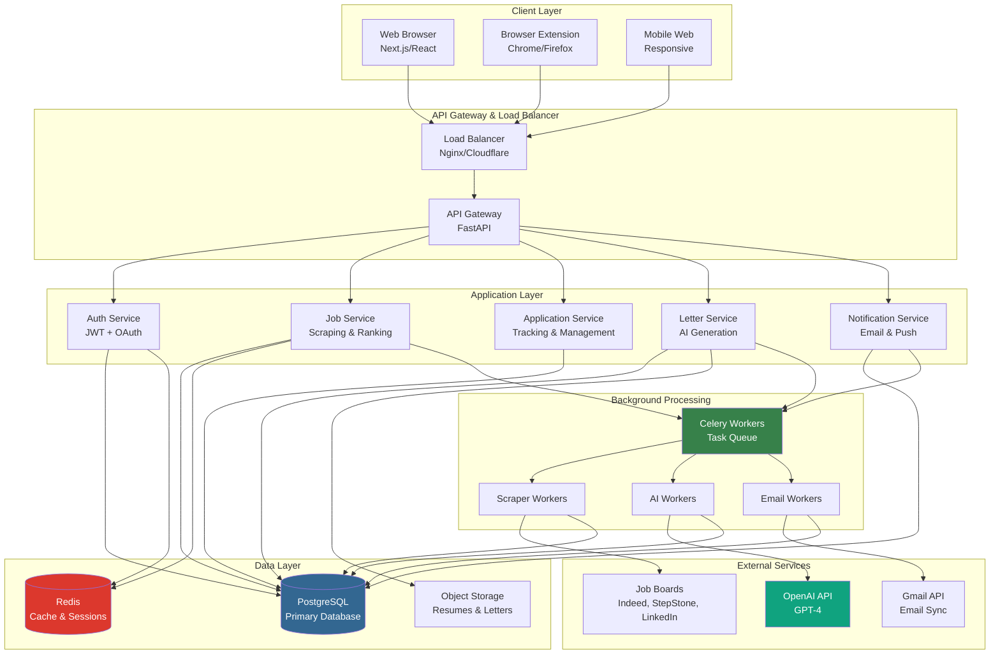
```mermaid
graph TB
    subgraph "Client Layer"
        Web[Web Browser<br/>Next.js/React]
        Extension[Browser Extension<br/>Chrome/Firefox]
        Mobile[Mobile Web<br/>Responsive]
    end
    
    subgraph "API Gateway & Load Balancer"
        LB[Load Balancer<br/>Nginx/Cloudflare]
        Gateway[API Gateway<br/>FastAPI]
    end
    
    subgraph "Application Layer"
        AuthService[Auth Service<br/>JWT + OAuth]
        JobService[Job Service<br/>Scraping & Ranking]
        AppService[Application Service<br/>Tracking & Management]
        LetterService[Letter Service<br/>AI Generation]
        NotificationService[Notification Service<br/>Email & Push]
    end
    
    subgraph "Data Layer"
        PostgreSQL[(PostgreSQL<br/>Primary Database)]
        Redis[(Redis<br/>Cache & Sessions)]
        S3[Object Storage<br/>Resumes & Letters]
    end
    
    subgraph "Background Processing"
        Celery[Celery Workers<br/>Task Queue]
        ScraperWorker[Scraper Workers]
        AIWorker[AI Workers]
        EmailWorker[Email Workers]
    end
    
    subgraph "External Services"
        OpenAI[OpenAI API<br/>GPT-4]
        Gmail[Gmail API<br/>Email Sync]
        JobBoards[Job Boards<br/>Indeed, StepStone, LinkedIn]
    end
    
    Web --> LB
    Extension --> LB
    Mobile --> LB
    LB --> Gateway
    
    Gateway --> AuthService
    Gateway --> JobService
    Gateway --> AppService
    Gateway --> LetterService
    Gateway --> NotificationService
    
    AuthService --> PostgreSQL
    AuthService --> Redis
    JobService --> PostgreSQL
    JobService --> Redis
    AppService --> PostgreSQL
    LetterService --> PostgreSQL
    LetterService --> S3
    NotificationService --> PostgreSQL
    
    JobService --> Celery
    LetterService --> Celery
    NotificationService --> Celery
    
    Celery --> ScraperWorker
    Celery --> AIWorker
    Celery --> EmailWorker
    
    ScraperWorker --> JobBoards
    ScraperWorker --> PostgreSQL
    AIWorker --> OpenAI
    AIWorker --> PostgreSQL
    EmailWorker --> Gmail
    EmailWorker --> PostgreSQL
    
    style PostgreSQL fill:#336791,color:#fff
    style Redis fill:#dc382d,color:#fff
    style OpenAI fill:#10a37f,color:#fff
    style Celery fill:#37814a,color:#fff
```

---

## Database Design

### Entity Relationship Diagram (ERD)

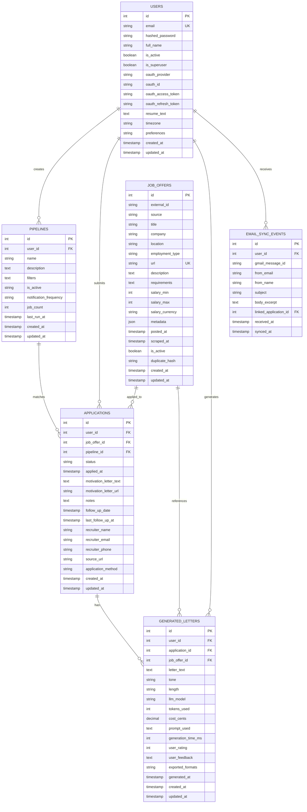
```mermaid
erDiagram
    USERS ||--o{ PIPELINES : "creates"
    USERS ||--o{ APPLICATIONS : "submits"
    USERS ||--o{ GENERATED_LETTERS : "generates"
    USERS ||--o{ EMAIL_SYNC_EVENTS : "receives"
    
    PIPELINES ||--o{ APPLICATIONS : "matches"
    JOB_OFFERS ||--o{ APPLICATIONS : "applied_to"
    JOB_OFFERS ||--o{ GENERATED_LETTERS : "references"
    APPLICATIONS ||--o{ GENERATED_LETTERS : "has"
    
    USERS {
        int id PK
        string email UK
        string hashed_password
        string full_name
        boolean is_active
        boolean is_superuser
        string oauth_provider
        string oauth_id
        string oauth_access_token
        string oauth_refresh_token
        text resume_text
        string timezone
        string preferences
        timestamp created_at
        timestamp updated_at
    }
    
    PIPELINES {
        int id PK
        int user_id FK
        string name
        text description
        text filters
        string is_active
        string notification_frequency
        int job_count
        timestamp last_run_at
        timestamp created_at
        timestamp updated_at
    }
    
    JOB_OFFERS {
        int id PK
        string external_id
        string source
        string title
        string company
        string location
        string employment_type
        string url UK
        text description
        text requirements
        int salary_min
        int salary_max
        string salary_currency
        json metadata
        timestamp posted_at
        timestamp scraped_at
        boolean is_active
        string duplicate_hash
        timestamp created_at
        timestamp updated_at
    }
    
    APPLICATIONS {
        int id PK
        int user_id FK
        int job_offer_id FK
        int pipeline_id FK
        string status
        timestamp applied_at
        text motivation_letter_text
        string motivation_letter_url
        text notes
        timestamp follow_up_date
        timestamp last_follow_up_at
        string recruiter_name
        string recruiter_email
        string recruiter_phone
        string source_url
        string application_method
        timestamp created_at
        timestamp updated_at
    }
    
    GENERATED_LETTERS {
        int id PK
        int user_id FK
        int application_id FK
        int job_offer_id FK
        text letter_text
        string tone
        string length
        string llm_model
        int tokens_used
        decimal cost_cents
        text prompt_used
        int generation_time_ms
        int user_rating
        text user_feedback
        string exported_formats
        timestamp generated_at
        timestamp created_at
        timestamp updated_at
    }
    
    EMAIL_SYNC_EVENTS {
        int id PK
        int user_id FK
        string gmail_message_id
        string from_email
        string from_name
        string subject
        text body_excerpt
        int linked_application_id FK
        timestamp received_at
        timestamp synced_at
    }
```

### Database Schema Details

#### 1. Users Table

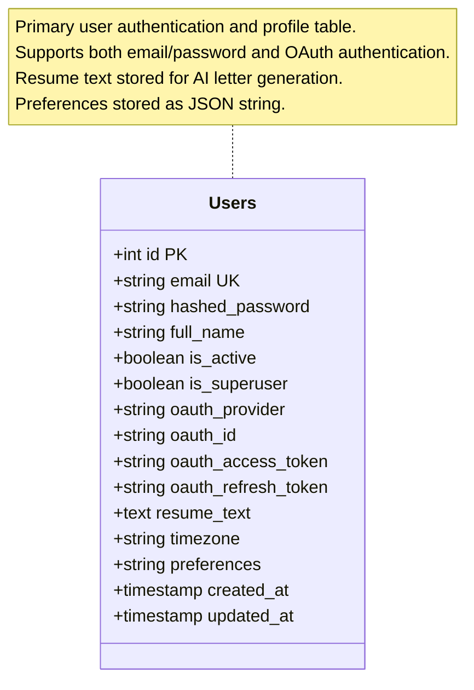
```mermaid
classDiagram
    class Users {
        +int id PK
        +string email UK
        +string hashed_password
        +string full_name
        +boolean is_active
        +boolean is_superuser
        +string oauth_provider
        +string oauth_id
        +string oauth_access_token
        +string oauth_refresh_token
        +text resume_text
        +string timezone
        +string preferences
        +timestamp created_at
        +timestamp updated_at
    }
    
    note for Users "Primary user authentication and profile table.<br/>Supports both email/password and OAuth authentication.<br/>Resume text stored for AI letter generation.<br/>Preferences stored as JSON string."
```

**Indexes:**
- Primary Key: `id`
- Unique Index: `email`
- Index: `oauth_provider, oauth_id` (composite, for OAuth lookups)
- Index: `is_active` (for filtering active users)

**Constraints:**
- `email` must be unique and not null
- `hashed_password` nullable (for OAuth-only users)
- `oauth_provider` and `oauth_id` must both be set if OAuth is used

#### 2. Pipelines Table

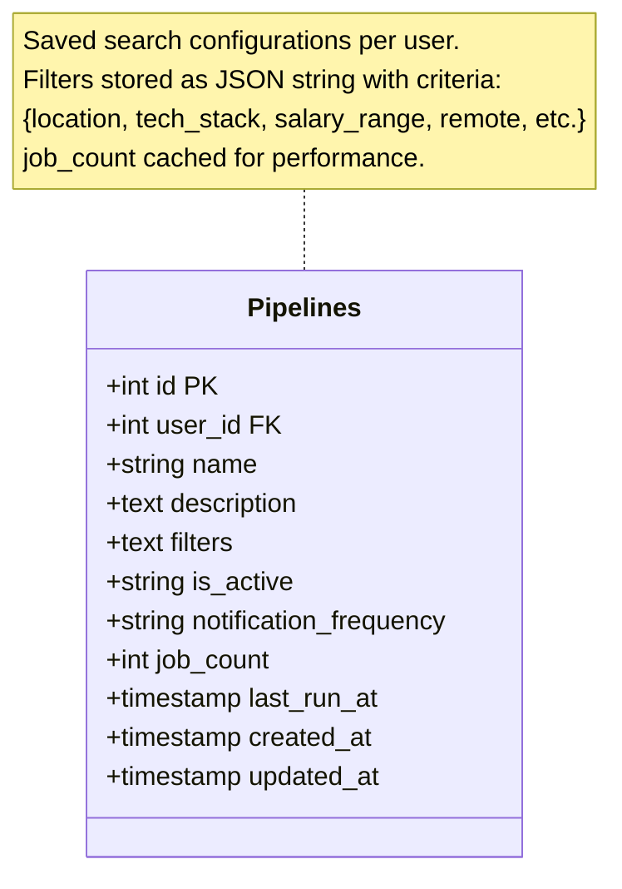
```mermaid
classDiagram
    class Pipelines {
        +int id PK
        +int user_id FK
        +string name
        +text description
        +text filters
        +string is_active
        +string notification_frequency
        +int job_count
        +timestamp last_run_at
        +timestamp created_at
        +timestamp updated_at
    }
    
    note for Pipelines "Saved search configurations per user.<br/>Filters stored as JSON string with criteria:<br/>{location, tech_stack, salary_range, remote, etc.}<br/>job_count cached for performance."
```

**Indexes:**
- Primary Key: `id`
- Foreign Key: `user_id` → `users.id`
- Index: `user_id, is_active` (composite, for active pipeline queries)

**Filter JSON Structure:**
```json
{
  "location": ["Berlin", "Remote"],
  "tech_stack": ["Python", "FastAPI", "React"],
  "min_salary": 60000,
  "max_salary": 100000,
  "employment_type": ["full-time"],
  "remote": true,
  "company_size": ["startup", "medium"],
  "keywords": ["backend", "API"]
}
```

#### 3. Job Offers Table

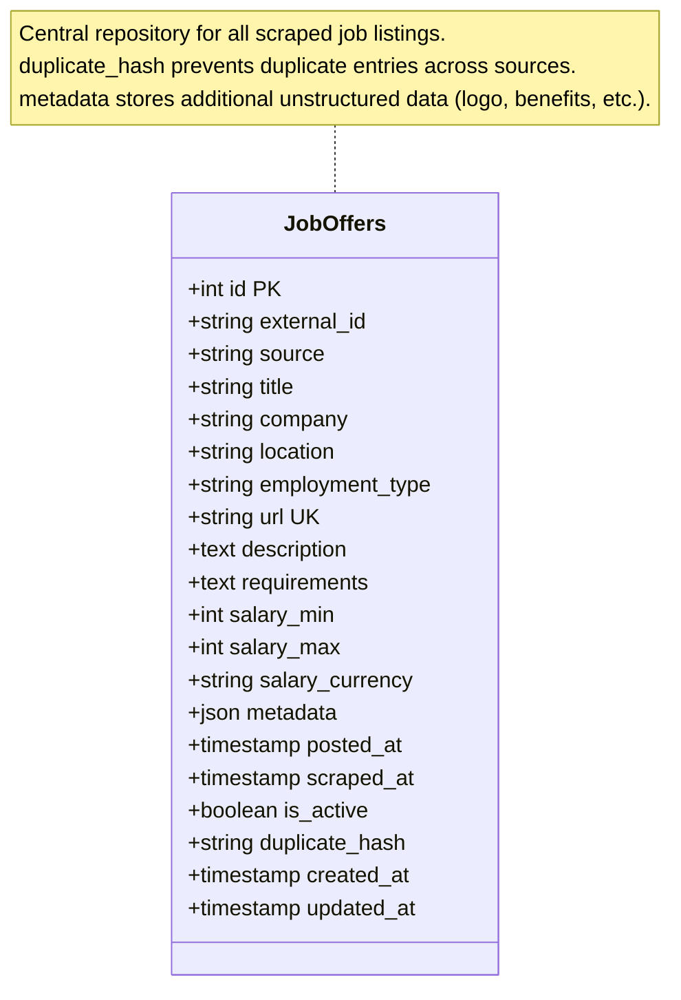
```mermaid
classDiagram
    class JobOffers {
        +int id PK
        +string external_id
        +string source
        +string title
        +string company
        +string location
        +string employment_type
        +string url UK
        +text description
        +text requirements
        +int salary_min
        +int salary_max
        +string salary_currency
        +json metadata
        +timestamp posted_at
        +timestamp scraped_at
        +boolean is_active
        +string duplicate_hash
        +timestamp created_at
        +timestamp updated_at
    }
    
    note for JobOffers "Central repository for all scraped job listings.<br/>duplicate_hash prevents duplicate entries across sources.<br/>metadata stores additional unstructured data (logo, benefits, etc.)."
```

**Indexes:**
- Primary Key: `id`
- Unique Index: `url` (prevents duplicate URLs)
- Index: `source, external_id` (composite, for source lookups)
- Index: `duplicate_hash` (for deduplication)
- Index: `title, company` (composite, for search)
- Index: `scraped_at` (for freshness queries)
- Index: `is_active` (for filtering active jobs)
- Full-text Index: `title, description` (for search)

**Metadata JSON Structure:**
```json
{
  "company_logo": "https://...",
  "benefits": ["health insurance", "remote work"],
  "company_size": "50-200",
  "industry": "Technology",
  "work_mode": "hybrid"
}
```

#### 4. Applications Table

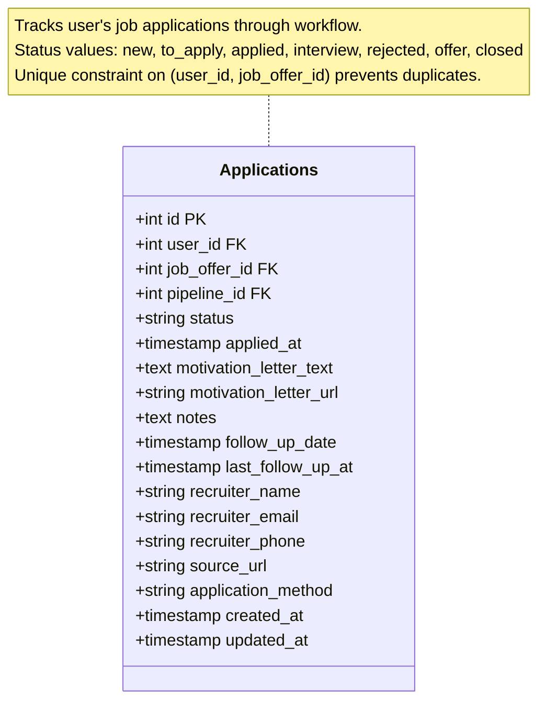
```mermaid
classDiagram
    class Applications {
        +int id PK
        +int user_id FK
        +int job_offer_id FK
        +int pipeline_id FK
        +string status
        +timestamp applied_at
        +text motivation_letter_text
        +string motivation_letter_url
        +text notes
        +timestamp follow_up_date
        +timestamp last_follow_up_at
        +string recruiter_name
        +string recruiter_email
        +string recruiter_phone
        +string source_url
        +string application_method
        +timestamp created_at
        +timestamp updated_at
    }
    
    note for Applications "Tracks user's job applications through workflow.<br/>Status values: new, to_apply, applied, interview, rejected, offer, closed<br/>Unique constraint on (user_id, job_offer_id) prevents duplicates."
```

**Indexes:**
- Primary Key: `id`
- Foreign Keys: `user_id`, `job_offer_id`, `pipeline_id`
- Unique Constraint: `(user_id, job_offer_id)` (prevents duplicate applications)
- Index: `user_id, status` (composite, for user dashboard queries)
- Index: `follow_up_date` (for reminder queries)
- Index: `applied_at` (for timeline views)

**Status Workflow:**
```
new → to_apply → applied → interview → offer/rejected → closed
```

#### 5. Generated Letters Table

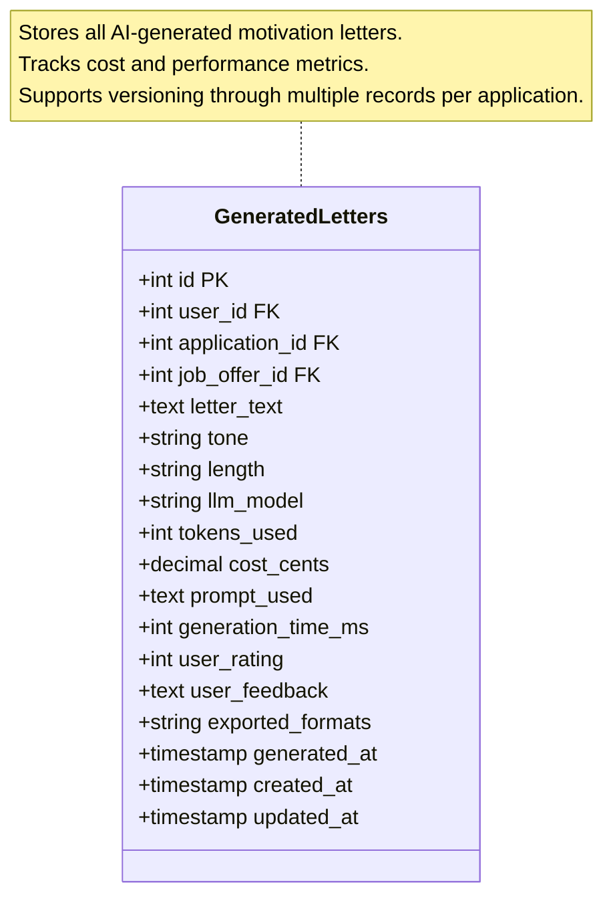
```mermaid
classDiagram
    class GeneratedLetters {
        +int id PK
        +int user_id FK
        +int application_id FK
        +int job_offer_id FK
        +text letter_text
        +string tone
        +string length
        +string llm_model
        +int tokens_used
        +decimal cost_cents
        +text prompt_used
        +int generation_time_ms
        +int user_rating
        +text user_feedback
        +string exported_formats
        +timestamp generated_at
        +timestamp created_at
        +timestamp updated_at
    }
    
    note for GeneratedLetters "Stores all AI-generated motivation letters.<br/>Tracks cost and performance metrics.<br/>Supports versioning through multiple records per application."
```

**Indexes:**
- Primary Key: `id`
- Foreign Keys: `user_id`, `application_id`, `job_offer_id`
- Index: `application_id` (for fetching letters by application)
- Index: `user_id, generated_at` (composite, for user history)
- Index: `llm_model` (for analytics)

#### 6. Email Sync Events Table

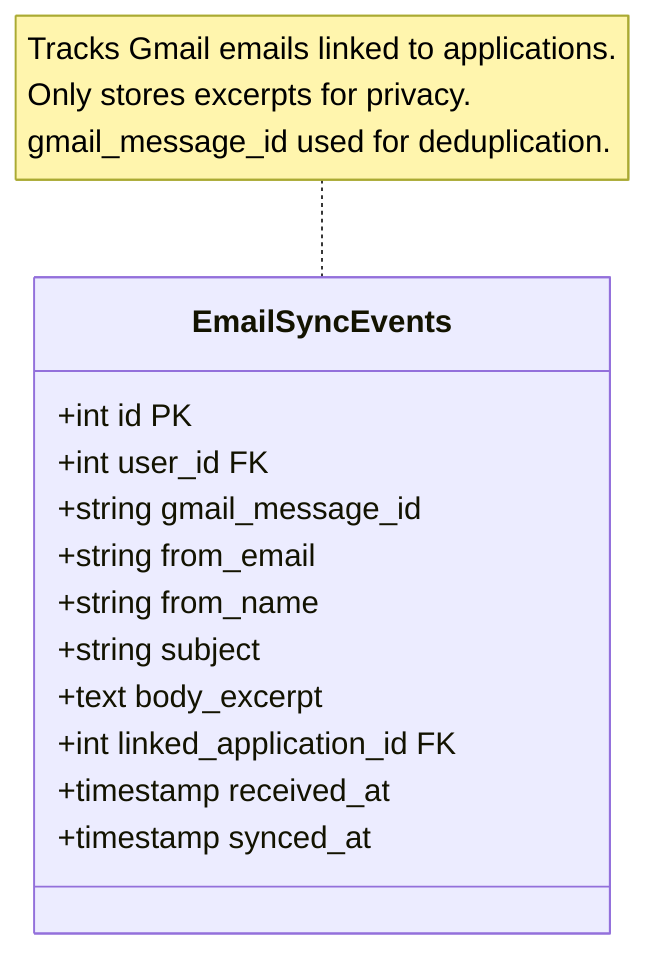
```mermaid
classDiagram
    class EmailSyncEvents {
        +int id PK
        +int user_id FK
        +string gmail_message_id
        +string from_email
        +string from_name
        +string subject
        +text body_excerpt
        +int linked_application_id FK
        +timestamp received_at
        +timestamp synced_at
    }
    
    note for EmailSyncEvents "Tracks Gmail emails linked to applications.<br/>Only stores excerpts for privacy.<br/>gmail_message_id used for deduplication."
```

**Indexes:**
- Primary Key: `id`
- Foreign Keys: `user_id`, `linked_application_id`
- Unique Index: `user_id, gmail_message_id` (prevents duplicate syncs)
- Index: `linked_application_id` (for application email timeline)

---

## Data Storage Strategy

### Storage Architecture

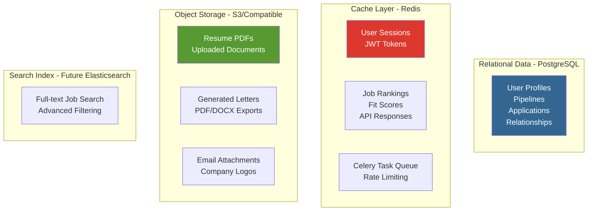
```mermaid
graph TB
    subgraph "Relational Data - PostgreSQL"
        UserData[User Profiles<br/>Pipelines<br/>Applications<br/>Relationships]
    end
    
    subgraph "Cache Layer - Redis"
        SessionCache[User Sessions<br/>JWT Tokens]
        DataCache[Job Rankings<br/>Fit Scores<br/>API Responses]
        QueueCache[Celery Task Queue<br/>Rate Limiting]
    end
    
    subgraph "Object Storage - S3/Compatible"
        ResumeFiles[Resume PDFs<br/>Uploaded Documents]
        LetterFiles[Generated Letters<br/>PDF/DOCX Exports]
        Attachments[Email Attachments<br/>Company Logos]
    end
    
    subgraph "Search Index - Future Elasticsearch"
        JobSearch[Full-text Job Search<br/>Advanced Filtering]
    end
    
    style UserData fill:#336791,color:#fff
    style SessionCache fill:#dc382d,color:#fff
    style ResumeFiles fill:#569a31,color:#fff
```

### Why PostgreSQL?

**Rationale:**
- **ACID Compliance**: Critical for user data integrity
- **JSONB Support**: Flexible storage for pipeline filters and job metadata
- **Full-text Search**: Built-in search capabilities for job descriptions
- **Mature Ecosystem**: Excellent tooling, monitoring, and backup solutions
- **Scalability**: Can handle millions of job listings with proper indexing
- **Relationships**: Complex relationships between users, jobs, and applications

**Use Cases:**
- User authentication and profiles
- Job listings with structured and semi-structured data
- Application tracking with complex workflows
- Relational queries (user's applications, pipeline matches)

### Why Redis?

**Rationale:**
- **Performance**: Sub-millisecond response times
- **Session Management**: Efficient JWT token storage
- **Caching**: Reduce database load for frequently accessed data
- **Task Queue**: Celery broker for background jobs
- **Rate Limiting**: Prevent API abuse

**Use Cases:**
- User session storage (30-day TTL)
- Cached job rankings (15-minute TTL)
- Fit scores (1-hour TTL)
- API response caching
- Celery task queue
- Rate limiting counters

### Why Object Storage (S3)?

**Rationale:**
- **Scalability**: Unlimited storage for files
- **Cost-effective**: Pay only for what you use
- **CDN Integration**: Fast global delivery
- **Versioning**: Track file changes
- **Security**: Fine-grained access control

**Use Cases:**
- Resume PDF uploads
- Generated letter exports (PDF, DOCX)
- Email attachments
- Company logos and images

### Data Retention Strategy

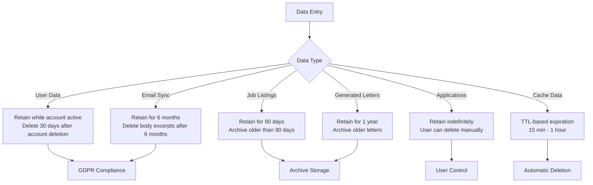
```mermaid
flowchart TD
    Data[Data Entry] --> Classify{Data Type}
    
    Classify -->|User Data| UserRetention[Retain while account active<br/>Delete 30 days after account deletion]
    Classify -->|Job Listings| JobRetention[Retain for 90 days<br/>Archive older than 90 days]
    Classify -->|Applications| AppRetention[Retain indefinitely<br/>User can delete manually]
    Classify -->|Generated Letters| LetterRetention[Retain for 1 year<br/>Archive older letters]
    Classify -->|Email Sync| EmailRetention[Retain for 6 months<br/>Delete body excerpts after 6 months]
    Classify -->|Cache Data| CacheRetention[TTL-based expiration<br/>15 min - 1 hour]
    
    UserRetention --> GDPR[GDPR Compliance]
    JobRetention --> Archive[Archive Storage]
    AppRetention --> UserControl[User Control]
    LetterRetention --> Archive
    EmailRetention --> GDPR
    CacheRetention --> AutoDelete[Automatic Deletion]
```

---

## System Components

### Component Architecture

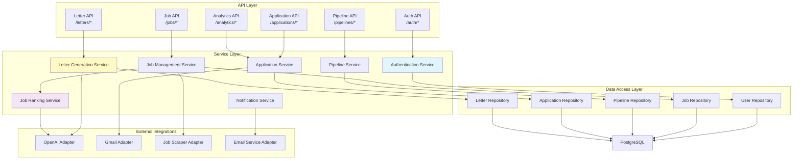
```mermaid
graph TB
    subgraph "API Layer"
        AuthAPI[Auth API<br/>/auth/*]
        JobAPI[Job API<br/>/jobs/*]
        PipelineAPI[Pipeline API<br/>/pipelines/*]
        AppAPI[Application API<br/>/applications/*]
        LetterAPI[Letter API<br/>/letters/*]
        AnalyticsAPI[Analytics API<br/>/analytics/*]
    end
    
    subgraph "Service Layer"
        AuthService[Authentication Service]
        JobService[Job Management Service]
        PipelineService[Pipeline Service]
        AppService[Application Service]
        LetterService[Letter Generation Service]
        RankingService[Job Ranking Service]
        NotificationService[Notification Service]
    end
    
    subgraph "Data Access Layer"
        UserRepo[User Repository]
        JobRepo[Job Repository]
        PipelineRepo[Pipeline Repository]
        AppRepo[Application Repository]
        LetterRepo[Letter Repository]
    end
    
    subgraph "External Integrations"
        OpenAIAdapter[OpenAI Adapter]
        GmailAdapter[Gmail Adapter]
        ScraperAdapter[Job Scraper Adapter]
        EmailAdapter[Email Service Adapter]
    end
    
    AuthAPI --> AuthService
    JobAPI --> JobService
    PipelineAPI --> PipelineService
    AppAPI --> AppService
    LetterAPI --> LetterService
    AnalyticsAPI --> AppService
    
    AuthService --> UserRepo
    JobService --> JobRepo
    JobService --> RankingService
    PipelineService --> PipelineRepo
    AppService --> AppRepo
    LetterService --> LetterRepo
    LetterService --> OpenAIAdapter
    RankingService --> OpenAIAdapter
    NotificationService --> EmailAdapter
    
    JobService --> ScraperAdapter
    AppService --> GmailAdapter
    
    UserRepo --> PostgreSQL
    JobRepo --> PostgreSQL
    PipelineRepo --> PostgreSQL
    AppRepo --> PostgreSQL
    LetterRepo --> PostgreSQL
    
    style AuthService fill:#e1f5ff
    style LetterService fill:#fff9c4
    style RankingService fill:#f3e5f5
```

### Service Responsibilities

#### 1. Authentication Service
- User registration and login
- JWT token generation and validation
- OAuth integration (Google, LinkedIn)
- Password hashing and verification
- Session management

#### 2. Job Management Service
- Job scraping orchestration
- Job deduplication
- Job storage and retrieval
- Job search and filtering
- Job ranking coordination

#### 3. Pipeline Service
- Pipeline CRUD operations
- Filter validation and application
- Job matching to pipelines
- Pipeline statistics calculation

#### 4. Application Service
- Application CRUD operations
- Status workflow management
- Follow-up scheduling
- Application analytics

#### 5. Letter Generation Service
- LLM integration
- Letter template management
- Letter generation and caching
- Cost tracking
- Export functionality

#### 6. Job Ranking Service
- Fit score calculation
- LLM-based ranking
- Score caching
- Ranking algorithm optimization

---

## Data Flow Diagrams

### 1. Job Scraping & Storage Flow

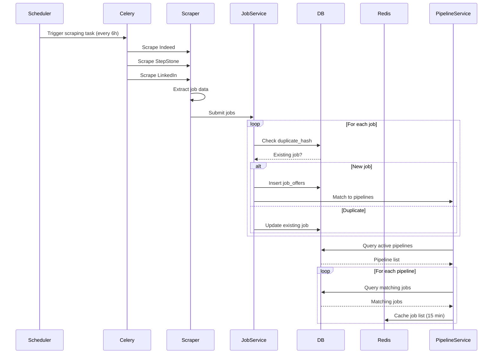
```mermaid
sequenceDiagram
    participant Scheduler
    participant Celery
    participant Scraper
    participant JobService
    participant DB
    participant Redis
    participant PipelineService
    
    Scheduler->>Celery: Trigger scraping task (every 6h)
    Celery->>Scraper: Scrape Indeed
    Celery->>Scraper: Scrape StepStone
    Celery->>Scraper: Scrape LinkedIn
    
    Scraper->>Scraper: Extract job data
    Scraper->>JobService: Submit jobs
    
    loop For each job
        JobService->>DB: Check duplicate_hash
        DB-->>JobService: Existing job?
        
        alt New job
            JobService->>DB: Insert job_offers
            JobService->>PipelineService: Match to pipelines
        else Duplicate
            JobService->>DB: Update existing job
        end
    end
    
    PipelineService->>DB: Query active pipelines
    DB-->>PipelineService: Pipeline list
    
    loop For each pipeline
        PipelineService->>DB: Query matching jobs
        DB-->>PipelineService: Matching jobs
        PipelineService->>Redis: Cache job list (15 min)
    end
```

### 2. Letter Generation & Caching Flow

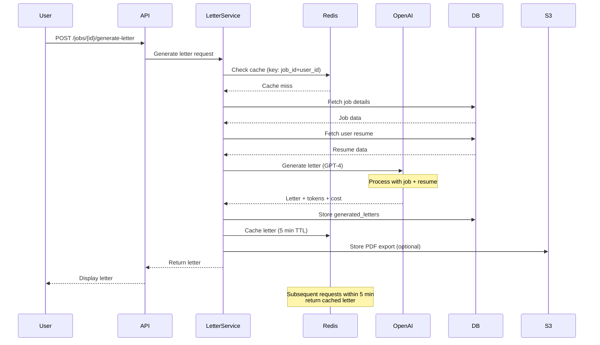
```mermaid
sequenceDiagram
    participant User
    participant API
    participant LetterService
    participant Redis
    participant OpenAI
    participant DB
    participant S3
    
    User->>API: POST /jobs/{id}/generate-letter
    API->>LetterService: Generate letter request
    
    LetterService->>Redis: Check cache (key: job_id+user_id)
    Redis-->>LetterService: Cache miss
    
    LetterService->>DB: Fetch job details
    DB-->>LetterService: Job data
    LetterService->>DB: Fetch user resume
    DB-->>LetterService: Resume data
    
    LetterService->>OpenAI: Generate letter (GPT-4)
    Note over OpenAI: Process with job + resume
    OpenAI-->>LetterService: Letter + tokens + cost
    
    LetterService->>DB: Store generated_letters
    LetterService->>Redis: Cache letter (5 min TTL)
    LetterService->>S3: Store PDF export (optional)
    LetterService-->>API: Return letter
    API-->>User: Display letter
    
    Note over Redis: Subsequent requests within 5 min<br/>return cached letter
```

### 3. Application Status Update Flow

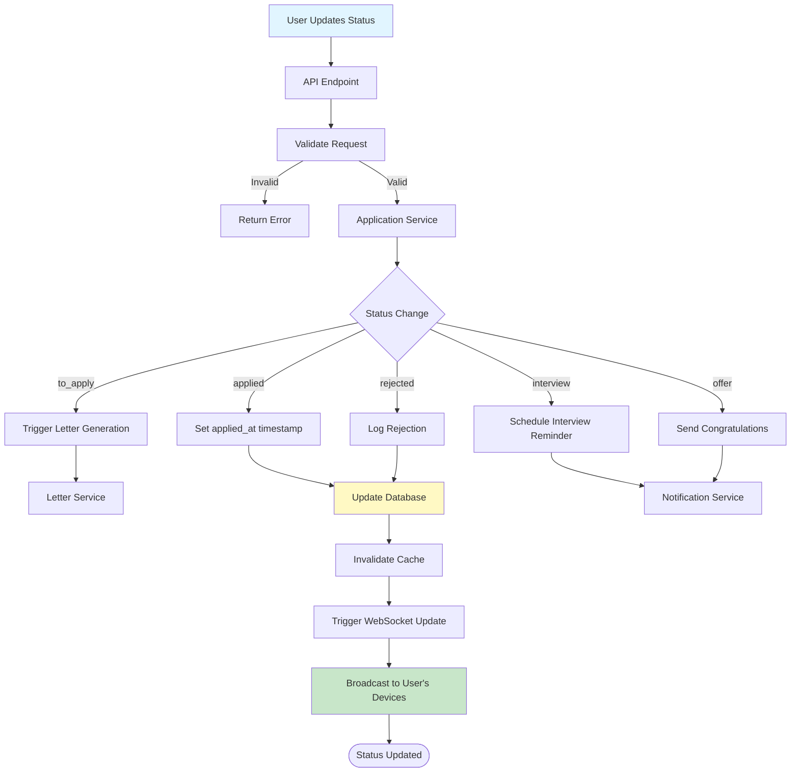
```mermaid
flowchart TD
    User[User Updates Status] --> API[API Endpoint]
    API --> Validate[Validate Request]
    Validate -->|Invalid| Error[Return Error]
    Validate -->|Valid| AppService[Application Service]
    
    AppService --> CheckStatus{Status Change}
    CheckStatus -->|to_apply| GenerateLetter[Trigger Letter Generation]
    CheckStatus -->|applied| SetAppliedAt[Set applied_at timestamp]
    CheckStatus -->|interview| ScheduleInterview[Schedule Interview Reminder]
    CheckStatus -->|offer| SendCongrats[Send Congratulations]
    CheckStatus -->|rejected| LogRejection[Log Rejection]
    
    GenerateLetter --> LetterService[Letter Service]
    SetAppliedAt --> UpdateDB[Update Database]
    ScheduleInterview --> NotificationService[Notification Service]
    SendCongrats --> NotificationService
    LogRejection --> UpdateDB
    
    UpdateDB --> UpdateCache[Invalidate Cache]
    UpdateCache --> TriggerWebSocket[Trigger WebSocket Update]
    TriggerWebSocket --> Broadcast[Broadcast to User's Devices]
    Broadcast --> End([Status Updated])
    
    style User fill:#e1f5ff
    style UpdateDB fill:#fff9c4
    style Broadcast fill:#c8e6c9
```

### 4. Pipeline Matching & Ranking Flow

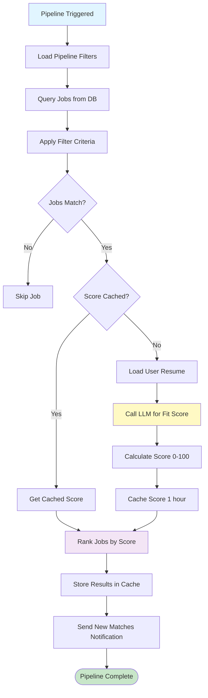
```mermaid
flowchart TD
    Trigger[Pipeline Triggered] --> LoadFilters[Load Pipeline Filters]
    LoadFilters --> QueryJobs[Query Jobs from DB]
    QueryJobs --> ApplyFilters[Apply Filter Criteria]
    
    ApplyFilters --> FilteredJobs{Jobs Match?}
    FilteredJobs -->|No| End1[Skip Job]
    FilteredJobs -->|Yes| CheckCache{Score Cached?}
    
    CheckCache -->|Yes| GetCached[Get Cached Score]
    CheckCache -->|No| LoadResume[Load User Resume]
    
    LoadResume --> CallLLM[Call LLM for Fit Score]
    CallLLM --> CalculateScore[Calculate Score 0-100]
    CalculateScore --> CacheScore[Cache Score 1 hour]
    
    GetCached --> RankJobs[Rank Jobs by Score]
    CacheScore --> RankJobs
    
    RankJobs --> StoreResults[Store Results in Cache]
    StoreResults --> SendNotification[Send New Matches Notification]
    SendNotification --> End2([Pipeline Complete])
    
    style Trigger fill:#e1f5ff
    style CallLLM fill:#fff9c4
    style RankJobs fill:#f3e5f5
    style End2 fill:#c8e6c9
```

---

## Technology Stack Decisions

### Database Technology Matrix

| Component | Technology | Rationale | Use Case |
|-----------|-----------|-----------|----------|
| **Primary DB** | PostgreSQL 15+ | ACID compliance, JSONB support, full-text search, mature ecosystem | User data, jobs, applications, relationships |
| **Cache** | Redis 7+ | Sub-millisecond latency, pub/sub, data structures | Sessions, caching, task queue, rate limiting |
| **Object Storage** | S3/Compatible | Scalable, cost-effective, CDN integration | Resumes, letter exports, attachments |
| **Search** | PostgreSQL FTS (MVP) / Elasticsearch (Future) | Built-in for MVP, dedicated search later | Job search, advanced filtering |

### Why Not NoSQL?

**MongoDB Consideration:**
- ❌ Complex relationships (users → pipelines → applications → jobs)
- ❌ ACID requirements for financial data (letter costs, subscriptions)
- ❌ SQL queries are more intuitive for reporting/analytics
- ✅ JSONB in PostgreSQL provides flexibility where needed

**When NoSQL Would Be Considered:**
- If job listings become extremely high-volume (millions/day)
- If we need horizontal sharding by user_id
- If we add real-time collaborative features

### Redis Usage Patterns

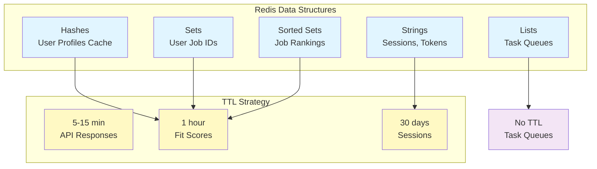
```mermaid
graph TB
    subgraph "Redis Data Structures"
        Strings[Strings<br/>Sessions, Tokens]
        Hashes[Hashes<br/>User Profiles Cache]
        Sets[Sets<br/>User Job IDs]
        SortedSets[Sorted Sets<br/>Job Rankings]
        Lists[Lists<br/>Task Queues]
    end
    
    subgraph "TTL Strategy"
        ShortTTL[5-15 min<br/>API Responses]
        MediumTTL[1 hour<br/>Fit Scores]
        LongTTL[30 days<br/>Sessions]
    end
    
    Strings --> LongTTL
    Hashes --> MediumTTL
    Sets --> MediumTTL
    SortedSets --> MediumTTL
    Lists --> NoTTL[No TTL<br/>Task Queues]
    
    style Strings fill:#e1f5ff
    style Hashes fill:#e1f5ff
    style Sets fill:#e1f5ff
    style SortedSets fill:#e1f5ff
    style Lists fill:#e1f5ff
    style ShortTTL fill:#fff9c4
    style MediumTTL fill:#fff9c4
    style LongTTL fill:#fff9c4
    style NoTTL fill:#f3e5f5
```

### Data Partitioning Strategy

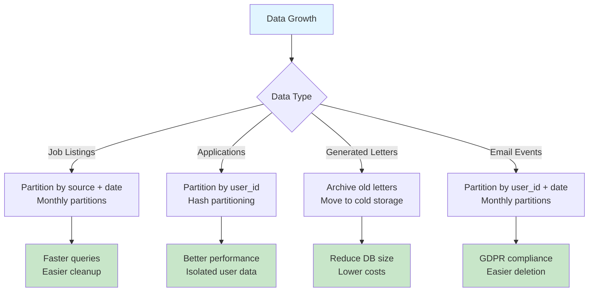
```mermaid
flowchart TD
    Data[Data Growth] --> Analyze{Data Type}
    
    Analyze -->|Job Listings| PartitionJobs[Partition by source + date<br/>Monthly partitions]
    Analyze -->|Applications| PartitionApps[Partition by user_id<br/>Hash partitioning]
    Analyze -->|Generated Letters| ArchiveLetters[Archive old letters<br/>Move to cold storage]
    Analyze -->|Email Events| PartitionEmail[Partition by user_id + date<br/>Monthly partitions]
    
    PartitionJobs --> Benefits1[Faster queries<br/>Easier cleanup]
    PartitionApps --> Benefits2[Better performance<br/>Isolated user data]
    ArchiveLetters --> Benefits3[Reduce DB size<br/>Lower costs]
    PartitionEmail --> Benefits4[GDPR compliance<br/>Easier deletion]
    
    style Data fill:#e1f5ff
    style Benefits1 fill:#c8e6c9
    style Benefits2 fill:#c8e6c9
    style Benefits3 fill:#c8e6c9
    style Benefits4 fill:#c8e6c9
```

### Backup & Disaster Recovery

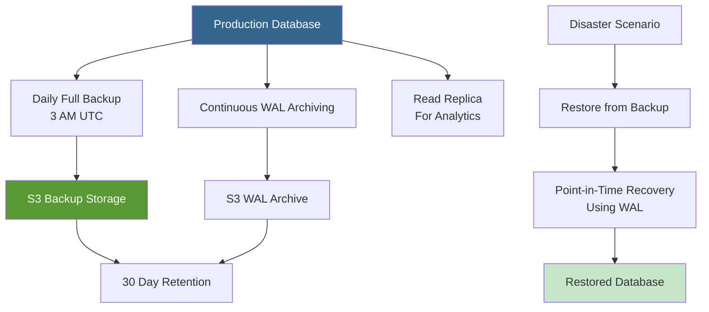
```mermaid
flowchart TD
    Production[Production Database] --> DailyBackup[Daily Full Backup<br/>3 AM UTC]
    Production --> ContinuousWAL[Continuous WAL Archiving]
    
    DailyBackup --> S3Backup[S3 Backup Storage]
    ContinuousWAL --> S3WAL[S3 WAL Archive]
    
    S3Backup --> Retention[30 Day Retention]
    S3WAL --> Retention
    
    Production --> Replica[Read Replica<br/>For Analytics]
    
    Disaster[Disaster Scenario] --> Restore[Restore from Backup]
    Restore --> PointInTime[Point-in-Time Recovery<br/>Using WAL]
    PointInTime --> RestoredDB[Restored Database]
    
    style Production fill:#336791,color:#fff
    style S3Backup fill:#569a31,color:#fff
    style RestoredDB fill:#c8e6c9
```

**Backup Strategy:**
- **Full Backups**: Daily at 3 AM UTC
- **WAL Archiving**: Continuous for point-in-time recovery
- **Retention**: 30 days for full backups, 7 days for WAL
- **Testing**: Monthly restore tests
- **RTO**: 1 hour (Recovery Time Objective)
- **RPO**: 5 minutes (Recovery Point Objective)

---

## Performance Optimization

### Indexing Strategy

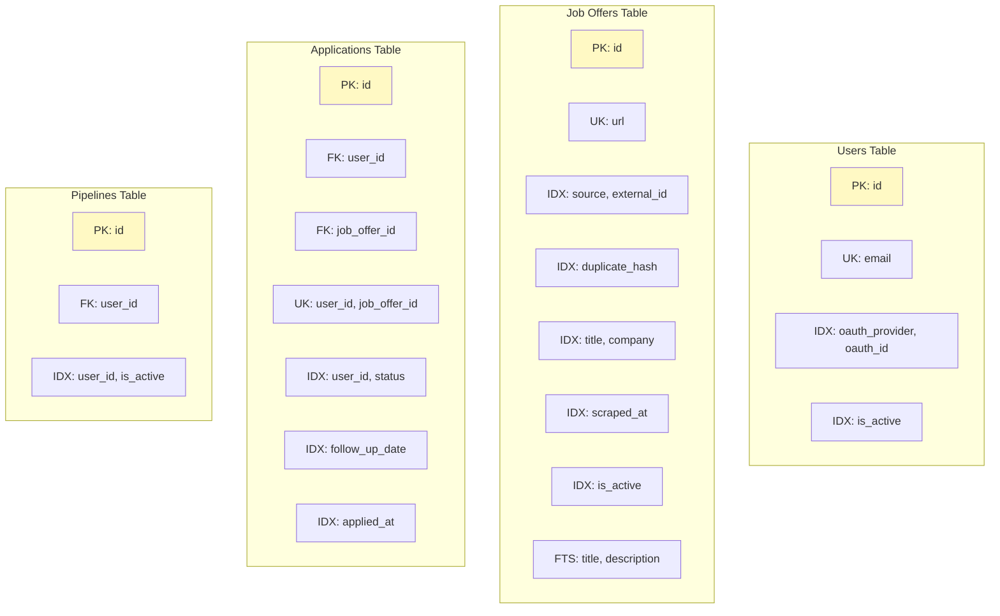
```mermaid
graph TB
    subgraph "Users Table"
        U1[PK: id]
        U2[UK: email]
        U3[IDX: oauth_provider, oauth_id]
        U4[IDX: is_active]
    end
    
    subgraph "Job Offers Table"
        J1[PK: id]
        J2[UK: url]
        J3[IDX: source, external_id]
        J4[IDX: duplicate_hash]
        J5[IDX: title, company]
        J6[IDX: scraped_at]
        J7[IDX: is_active]
        J8[FTS: title, description]
    end
    
    subgraph "Applications Table"
        A1[PK: id]
        A2[FK: user_id]
        A3[FK: job_offer_id]
        A4[UK: user_id, job_offer_id]
        A5[IDX: user_id, status]
        A6[IDX: follow_up_date]
        A7[IDX: applied_at]
    end
    
    subgraph "Pipelines Table"
        P1[PK: id]
        P2[FK: user_id]
        P3[IDX: user_id, is_active]
    end
    
    style U1 fill:#fff9c4
    style J1 fill:#fff9c4
    style A1 fill:#fff9c4
    style P1 fill:#fff9c4
```

### Query Optimization Patterns

1. **Eager Loading**: Use SQLAlchemy `joinedload` for related data
2. **Pagination**: Always paginate large result sets
3. **Selective Fields**: Only fetch required columns
4. **Connection Pooling**: Configure appropriate pool size
5. **Query Caching**: Cache expensive queries in Redis

### Scaling Considerations

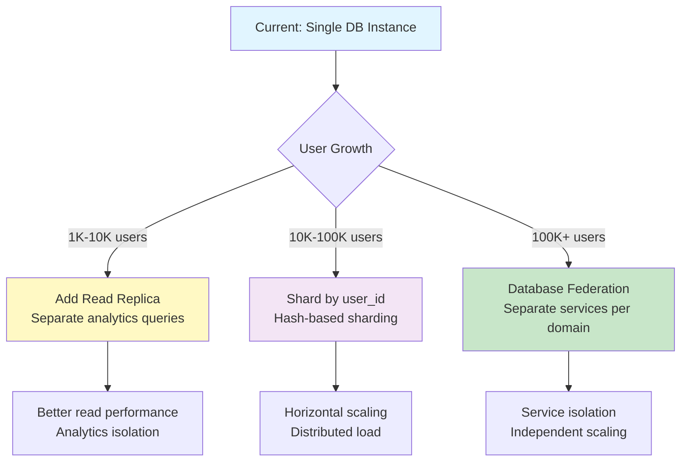
```mermaid
flowchart TD
    Current[Current: Single DB Instance] --> Growth{User Growth}
    
    Growth -->|1K-10K users| ReadReplica[Add Read Replica<br/>Separate analytics queries]
    Growth -->|10K-100K users| Sharding[Shard by user_id<br/>Hash-based sharding]
    Growth -->|100K+ users| Federation[Database Federation<br/>Separate services per domain]
    
    ReadReplica --> Benefits1[Better read performance<br/>Analytics isolation]
    Sharding --> Benefits2[Horizontal scaling<br/>Distributed load]
    Federation --> Benefits3[Service isolation<br/>Independent scaling]
    
    style Current fill:#e1f5ff
    style ReadReplica fill:#fff9c4
    style Sharding fill:#f3e5f5
    style Federation fill:#c8e6c9
```

---

## Security & Compliance

### Data Encryption

```mermaid
graph TB
    subgraph "In Transit"
        TLS[TLS 1.3<br/>All API Communication]
        DBSSL[SSL/TLS<br/>Database Connections]
    end
    
    subgraph "At Rest"
        DBEncrypt[AES-256<br/>Database Encryption]
        S3Encrypt[Server-Side Encryption<br/>S3 Objects]
        TokenEncrypt[Encrypted Storage<br/>OAuth Tokens]
    end
    
    subgraph "Sensitive Fields"
        PasswordHash[bcrypt<br/>Password Hashing]
        TokenHash[HMAC<br/>JWT Signing]
    end
    
    style TLS fill:#c8e6c9
    style DBEncrypt fill:#fff9c4
    style PasswordHash fill:#f3e5f5
```

### GDPR Compliance

- **Right to Access**: Users can export all their data
- **Right to Deletion**: Account deletion removes all user data within 30 days
- **Data Portability**: Export data in JSON/CSV format
- **Consent Management**: Clear consent for data processing
- **Data Minimization**: Only collect necessary data
- **Retention Policies**: Automatic deletion of old data

---

## Conclusion

This document provides a comprehensive database and system design for JobFlow:

1. **Complete ERD** showing all entities and relationships
2. **Storage strategy** explaining technology choices
3. **Data flow diagrams** illustrating system interactions
4. **Performance optimization** strategies
5. **Scaling considerations** for future growth

**Key Design Principles:**
- **Relational DB (PostgreSQL)** for structured data and relationships
- **Redis** for caching and performance
- **S3** for object storage
- **Horizontal scaling** ready architecture
- **Security-first** approach with encryption at all layers

---

**Next Steps:**
- Implement database migrations
- Set up Redis caching layer
- Configure S3 for object storage
- Implement backup and monitoring
- Performance testing and optimization
