# User Flows & Interaction Design
## JobFlow - Job Application Automation Platform

**Document Version:** 1.0  
**Last Updated:** December 2025  
**Author:** System Architecture Team

---

## Table of Contents
1. [User Journey Overview](#user-journey-overview)
2. [Core User Flows](#core-user-flows)
3. [System Interaction Sequences](#system-interaction-sequences)
4. [UI/UX Flow Diagrams](#uiux-flow-diagrams)

---

## User Journey Overview

### Primary User Personas
- **Career Changer (Alex)**: 28-35, switching industries, applies to 10-15 positions/month
- **Fresh Graduate (Jordan)**: 22-26, entry-level hunting, needs structured guidance
- **Power User (Sam)**: 35-45, strategic job search, needs analytics and insights

### Journey Stages
1. **Discovery & Onboarding** (5-8 minutes)
2. **Daily/Weekly Engagement** (10-20 minutes, 3-5x/week)
3. **Application Management** (ongoing)
4. **Analytics & Optimization** (weekly/monthly)

---

## Core User Flows

### 1. New User Onboarding Flow

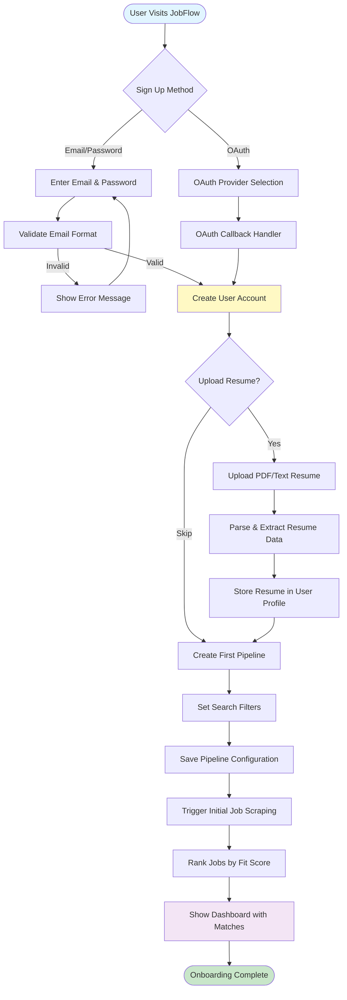

### 2. Daily/Weekly Check-In Flow

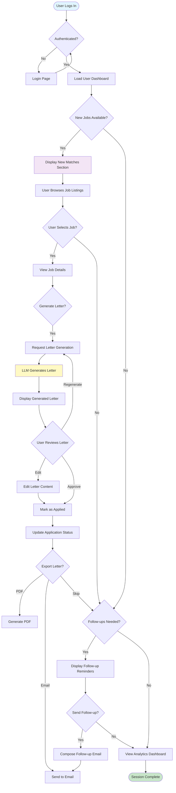

### 3. Job Application Workflow

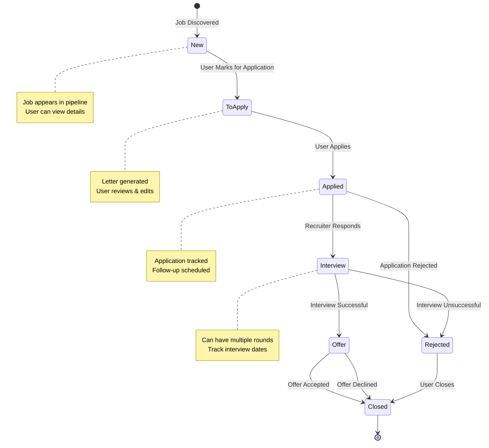

### 4. Motivation Letter Generation Flow

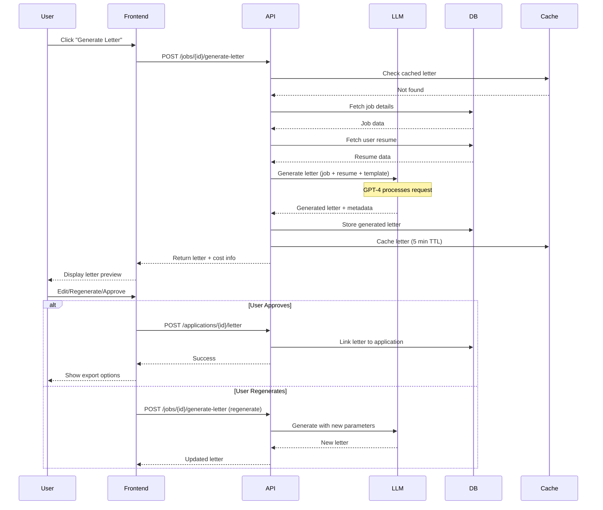

### 5. Job Scraping & Ranking Flow

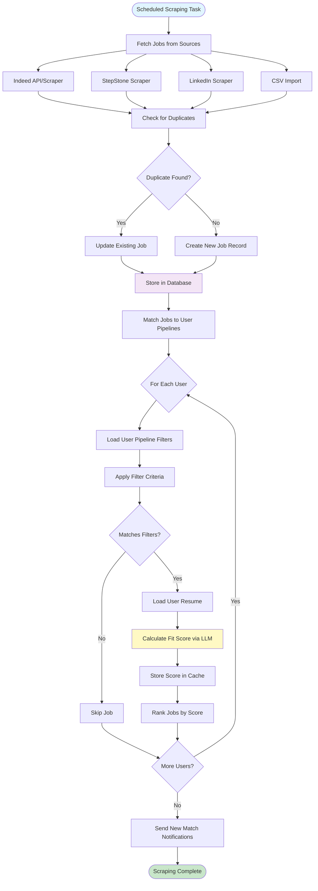

---

## System Interaction Sequences

### 1. Authentication & Session Management

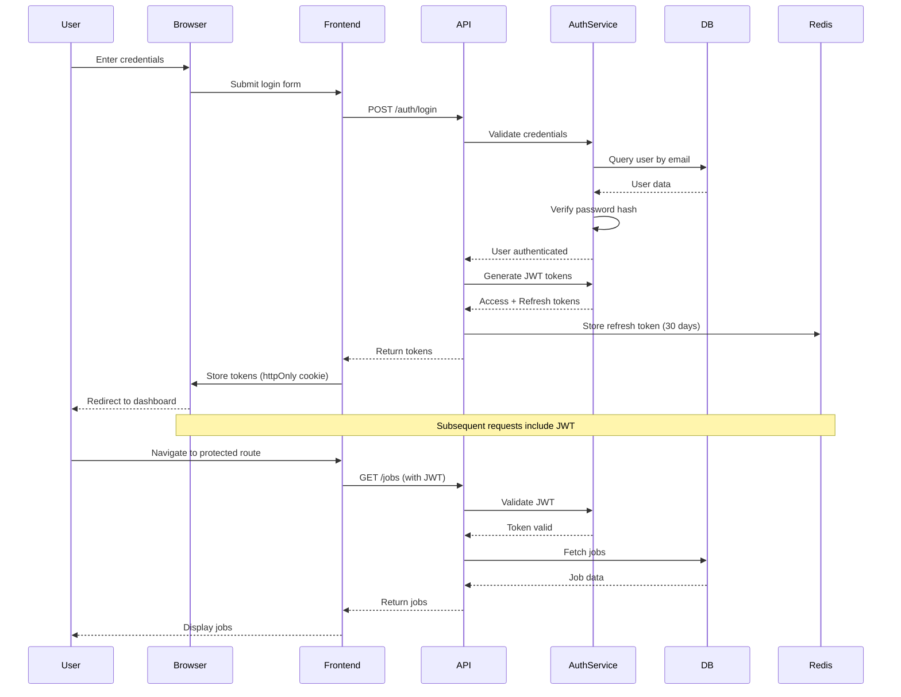

### 2. Pipeline Creation & Job Matching

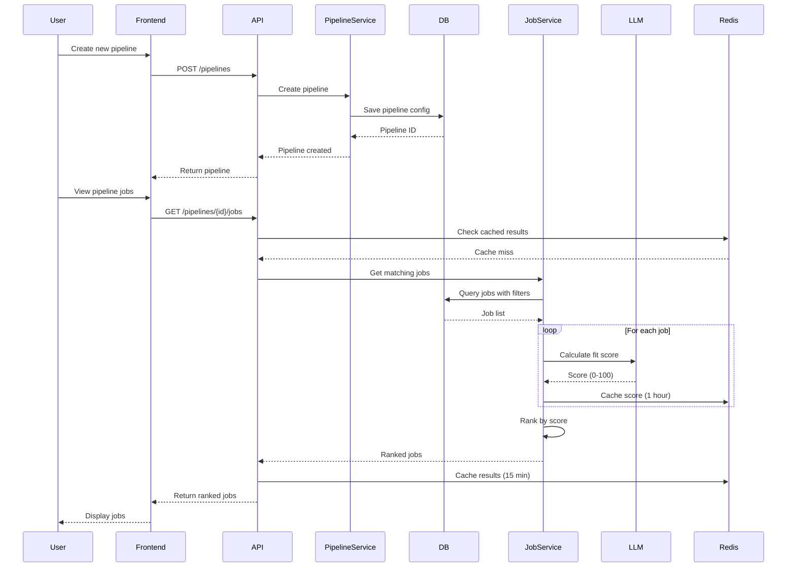

### 3. Application Status Update Flow

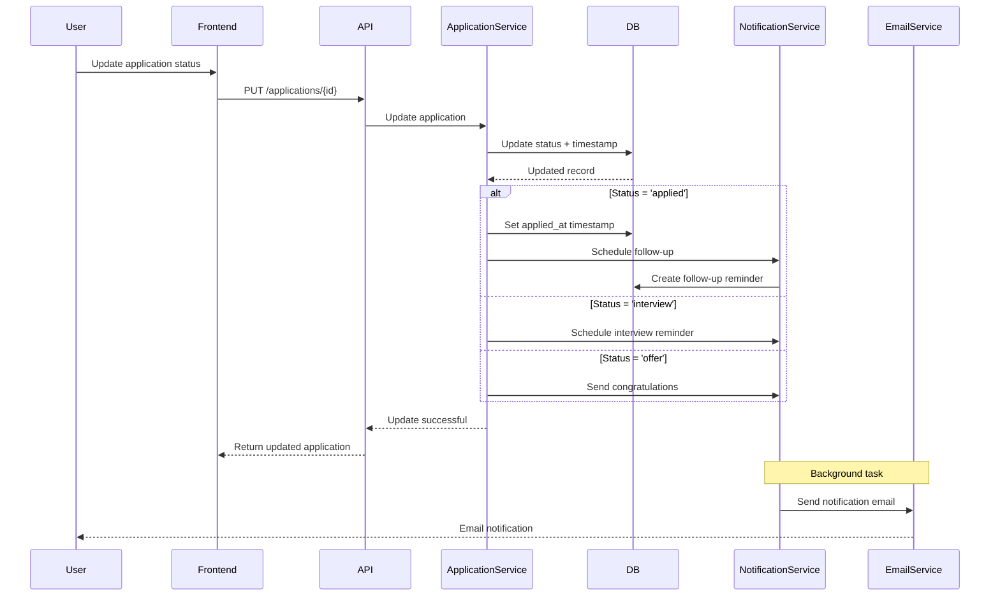

### 4. Gmail Sync Flow (Phase 2)

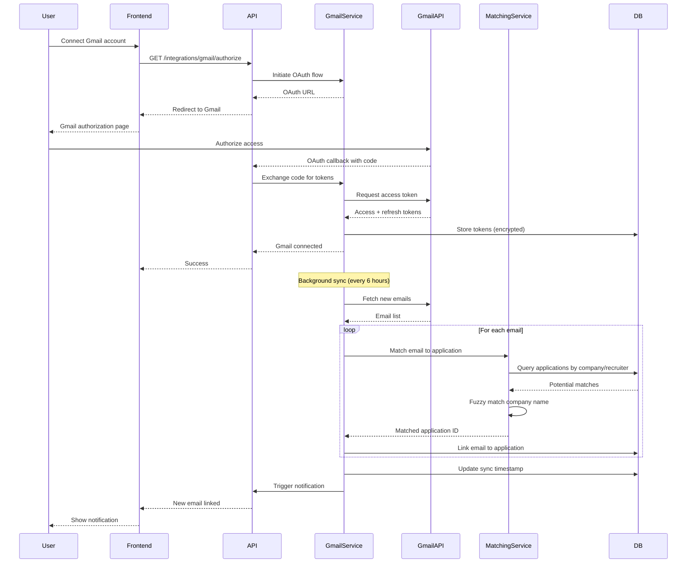

---

## UI/UX Flow Diagrams

### 1. Dashboard Navigation Flow

```mermaid
flowchart TB
    Dashboard[Main Dashboard] --> NewMatches[New Matches Tab]
    Dashboard --> Applications[Applications Tab]
    Dashboard --> Pipelines[Pipelines Tab]
    Dashboard --> Analytics[Analytics Tab]
    Dashboard --> Settings[Settings Tab]
    
    NewMatches --> JobCard[Job Card Component]
    JobCard --> JobDetails[Job Details Modal]
    JobDetails --> GenerateLetter[Generate Letter]
    JobDetails --> MarkApplied[Mark as Applied]
    JobDetails --> AddToPipeline[Add to Pipeline]
    
    Applications --> KanbanView[Kanban Board View]
    Applications --> TableView[Table View]
    Applications --> TimelineView[Timeline View]
    
    KanbanView --> ApplicationCard[Application Card]
    ApplicationCard --> EditStatus[Edit Status]
    ApplicationCard --> ViewLetter[View Letter]
    ApplicationCard --> AddNote[Add Note]
    ApplicationCard --> ScheduleFollowUp[Schedule Follow-up]
    
    Pipelines --> PipelineList[Pipeline List]
    PipelineList --> CreatePipeline[Create Pipeline]
    PipelineList --> EditPipeline[Edit Pipeline]
    PipelineList --> ViewPipelineJobs[View Pipeline Jobs]
    
    Analytics --> SummaryStats[Summary Statistics]
    Analytics --> Charts[Charts & Graphs]
    Analytics --> ExportData[Export Data]
    
    Settings --> Profile[Profile Settings]
    Settings --> Notifications[Notification Preferences]
    Settings --> Integrations[Integrations]
    Settings --> Billing[Billing & Subscription]
    
    style Dashboard fill:#e1f5ff
    style NewMatches fill:#f3e5f5
    style Applications fill:#fff9c4
    style Analytics fill:#c8e6c9
```

### 2. Letter Generation Modal Flow

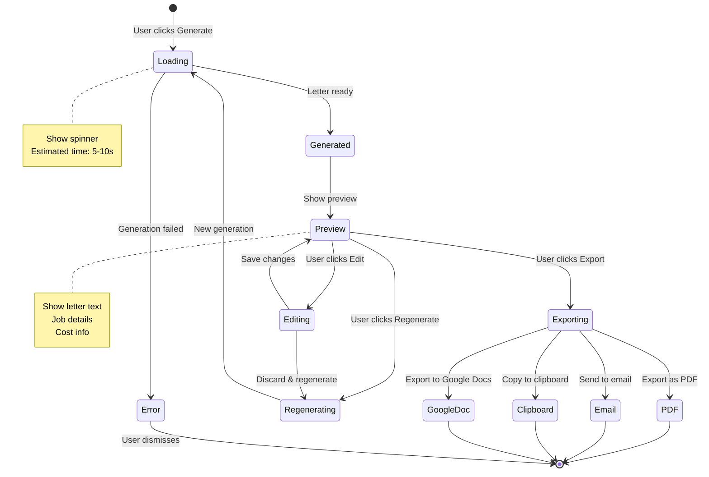

### 3. Application Tracking Kanban Flow

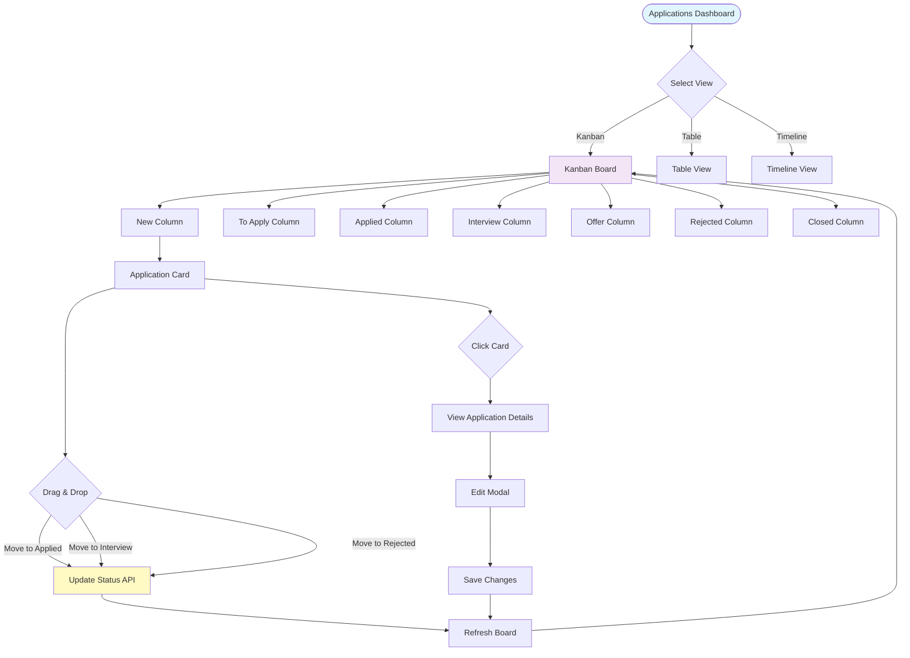

---

## User Interaction Patterns

### 1. Search & Filter Interaction

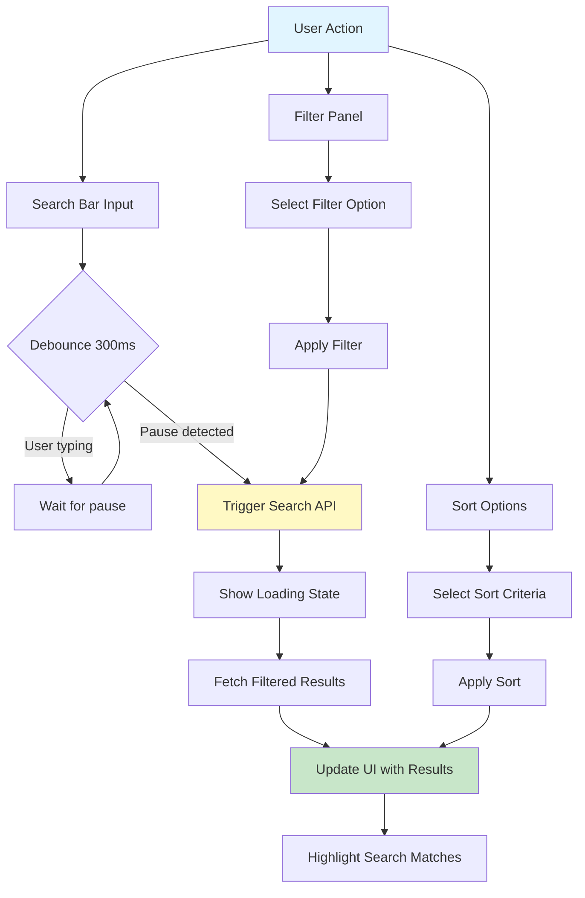

### 2. Real-time Updates Flow

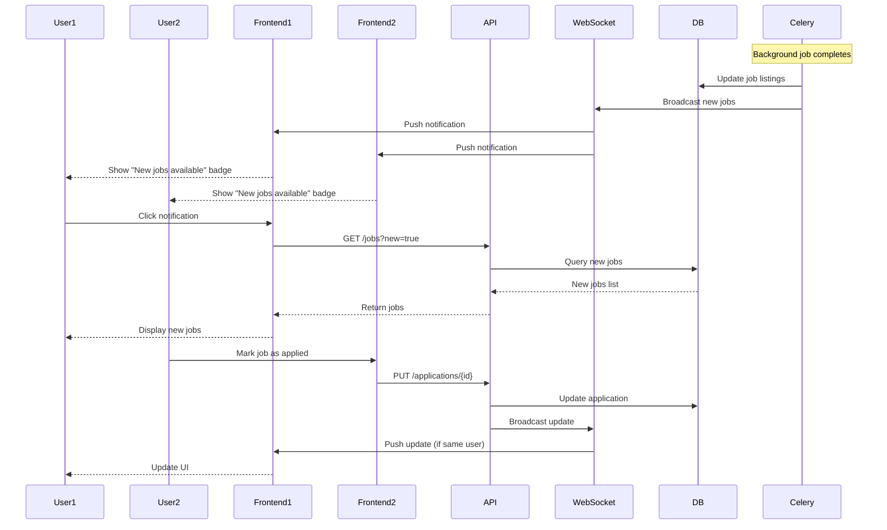

---

## Error Handling Flows

### 1. Error Recovery Flow

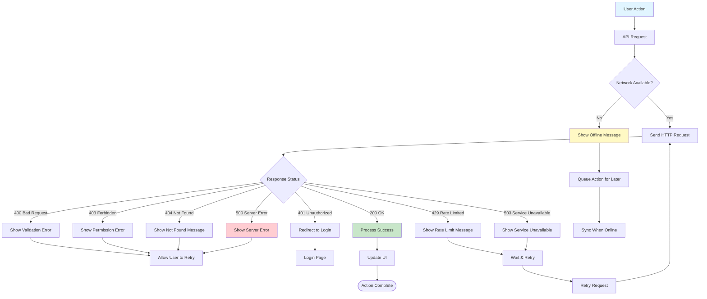

---

## Performance Optimization Flows

### 1. Caching Strategy Flow

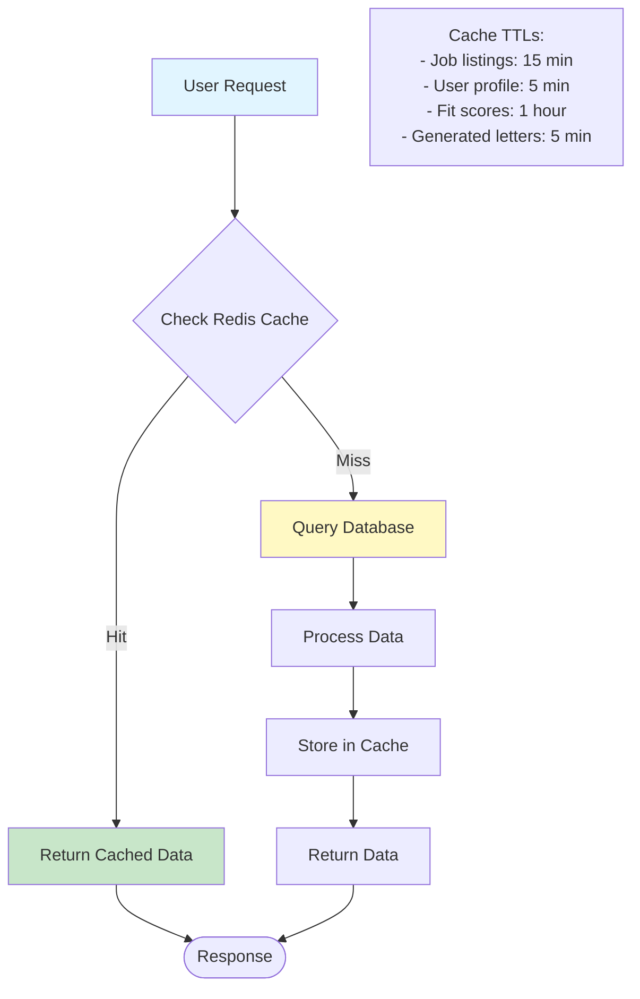

### 2. Lazy Loading & Pagination Flow

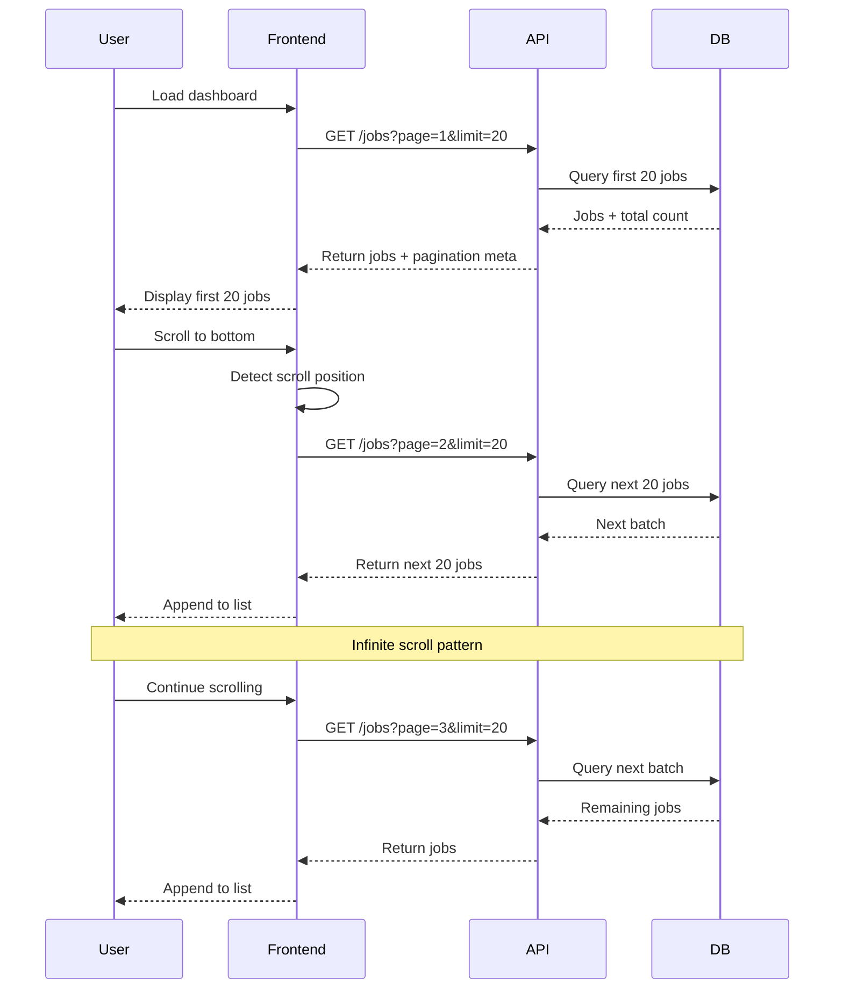

---

## Conclusion

This document provides comprehensive user flows and interaction designs for the JobFlow platform. The diagrams illustrate:

1. **Complete user journeys** from onboarding to daily usage
2. **System interactions** showing how components communicate
3. **UI/UX flows** for key features
4. **Error handling** and recovery patterns
5. **Performance optimization** strategies

These flows serve as a blueprint for:
- Frontend development
- Backend API design
- Integration testing
- User acceptance testing
- Product documentation

---

**Next Steps:**
- Create detailed wireframes based on these flows
- Develop user stories for each flow
- Implement A/B testing scenarios
- Create interactive prototypes
